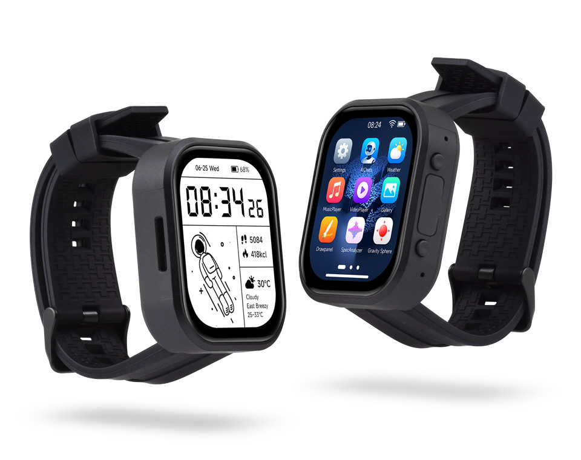

  <h1>ESP32-S3-Touch-AMOLED-2.06</h1>
  
<strong>ESP32-S3 2.06 英寸 410 x 502 QSPI AMOLED 触摸开发板</strong>

  

    
    
    
  

  
<a href="README.md">English</a>

  

    <a href="https://www.waveshare.net/shop/ESP32-S3-Touch-AMOLED-2.06.htm">🌐 产品</a> &middot;
    <a href="docs/ci_ZH.md">📚 文档</a> &middot;
    <a href="FirmWare/README_ZH.md">📦 固件</a> &middot;
    <a href="examples/esp-idf/">🧩 ESP-IDF</a> &middot;
    <a href="examples/arduino/">🔧 Arduino</a>
  

---

## ✨ 概览

本仓库提供适用于 Waveshare ESP32-S3-Touch-AMOLED-2.06 的第一方 ESP-IDF 和
Arduino 示例、源码构建固件包、出厂恢复固件、原理图和产品资料。

## 🖥️ 硬件概览

| 功能 | 器件 / 接口 |
| --- | --- |
| MCU | ESP32-S3 32 位 LX7 双核处理器 |
| 显示 | 2.06 英寸 410 x 502 QSPI AMOLED，使用 CO5300 |
| 触摸 | FT3168 电容触摸控制器，使用兼容 FT3x68 的驱动，I2C 地址为 `0x38` |
| 电源管理 | AXP2101 |
| 运动传感器 | QMI8658 六轴 IMU |
| 音频 | 双数字麦克风、ES7210 ADC 和 ES8311 编解码器 |
| 板级支持 | 托管组件 `waveshare/esp32_s3_touch_amoled_2_06` |
| 硬件文件 | [原理图](Schematic/)和[产品资料](Material/) |

## 📦 固件发布

可从[最新发布](https://github.com/waveshareteam/ESP32-S3-Touch-AMOLED-2.06/releases/latest)
或已完成的 `Build Examples` 工作流运行获取可刷写包。

1. 下载所需示例和框架版本对应的 `firmware-*` 归档包。
2. 解压后使用 `python -m pip install esptool` 安装 esptool。
3. 通过 USB 连接开发板。
4. Windows 运行 `flash.bat COMx`，Linux 运行 `./flash.sh /dev/ttyUSB0`。
5. 如未自动重启，请重置开发板。

每个包都包含偏移 `0x0` 的合并固件映像、源码段、刷写参数、辅助脚本和清单。
[FirmWare](FirmWare/) 下的出厂恢复文件是独立的不可变工件；详见
[固件工件](docs/firmware_ZH.md)。

## 🧪 示例

| ESP-IDF 示例 | 重点 |
| --- | --- |
| [01_AXP2101](examples/esp-idf/01_AXP2101/) | 电源管理和电池遥测 |
| [02_lvgl_demo_v9](examples/esp-idf/02_lvgl_demo_v9/) | LVGL 9 显示与触摸演示 |
| [03_esp-brookesia](examples/esp-idf/03_esp-brookesia/) | ESP-Brookesia 应用界面 |
| [04_Immersive_block](examples/esp-idf/04_Immersive_block/) | 运动驱动的 LVGL 方块演示 |
| [05_Spec_Analyzer](examples/esp-idf/05_Spec_Analyzer/) | 麦克风频谱分析仪 |
| [06_videoplayer](examples/esp-idf/06_videoplayer/) | 带音频的 SD 卡视频播放 |

| Arduino 示例 | 重点 |
| --- | --- |
| [01_HelloWorld](examples/arduino/01_HelloWorld/) | 显示初始化 |
| [02_GFX_AsciiTable](examples/arduino/02_GFX_AsciiTable/) | GFX 文本和字符渲染 |
| [03_LVGL_PCF85063_simpleTime](examples/arduino/03_LVGL_PCF85063_simpleTime/) | 使用 PCF85063 RTC 的 LVGL 时钟界面 |
| [04_LVGL_QMI8658_ui](examples/arduino/04_LVGL_QMI8658_ui/) | LVGL IMU 数据界面 |
| [05_LVGL_AXP2101_ADC_Data](examples/arduino/05_LVGL_AXP2101_ADC_Data/) | LVGL 电源和电池遥测界面 |
| [06_LVGL_Arduino_v9](examples/arduino/06_LVGL_Arduino_v9/) | LVGL 9 界面演示 |
| [07_LVGL_SD_Test](examples/arduino/07_LVGL_SD_Test/) | SD 卡测试 |
| [08_ES8311](examples/arduino/08_ES8311/) | ES8311 音频编解码器示例 |

[`examples/arduino/libraries/`](examples/arduino/libraries/) 中的随附库由产品草图使用；
其中的上游示例不属于产品 CI。

## 🛠️ 支持的工具链

| 平台 | 版本 |
| --- | --- |
| ESP-IDF | `v5.5.5` 和 `v6.0.2` |
| Arduino-ESP32 | `3.3.11` |

[Build Examples 工作流](https://github.com/waveshareteam/ESP32-S3-Touch-AMOLED-2.06/actions/workflows/examples.yml)
会发现维护中的第一方项目并打包成功构建；手动运行可使用 `target=all`、示例名称或示例路径。
详见[持续集成](docs/ci_ZH.md)。

## 🗂️ 仓库布局

| 路径 | 用途 |
| --- | --- |
| [`examples/esp-idf/`](examples/esp-idf/) | 第一方 ESP-IDF 项目 |
| [`examples/arduino/`](examples/arduino/) | 第一方 Arduino 草图和随附库 |
| [`FirmWare/`](FirmWare/) | 已提交的出厂和恢复二进制文件 |
| [`Material/`](Material/) | 产品媒体和参考资料 |
| [`Schematic/`](Schematic/) | 原理图文件 |
| [`releases/`](releases/) | 固件打包和工件下载工具 |
| [`scripts/`](scripts/) | 示例发现和 CI 辅助脚本 |
| [`docs/`](docs/) | 仓库、CI 和固件说明 |

## 📚 文档

- [仓库结构](docs/repository-structure_ZH.md)
- [持续集成](docs/ci_ZH.md)
- [固件工件](docs/firmware_ZH.md)
- [发布工具](releases/README_ZH.md)

## 🤝 支持与贡献

欢迎贡献和提交可复现的问题报告。请包含示例路径、框架版本、复现步骤、预期行为、实际行为和相关
串口日志。

- [贡献指南](CONTRIBUTING_ZH.md)
- [支持](SUPPORT_ZH.md)
- [安全策略](SECURITY_ZH.md)
- [提交问题](https://github.com/waveshareteam/ESP32-S3-Touch-AMOLED-2.06/issues/new/choose)

## 📄 许可证

本仓库采用 Apache License 2.0，详见 [LICENSE](LICENSE)。
